## Nicholas Namusanga

**GPU Kernel Engineer.** CUDA kernel development, PTX/SASS-level performance tuning, 10 years of GPU compute.

I write kernels for the problems the matmul tutorials skip: sampling, lookups and random state, where the roof is DRAM bandwidth and latency rather than FLOPs. Every kernel gets a predicted number before it is written and an Nsight retro after.

  

### Highlights

- **[cuda-orbital-sampler](https://github.com/nnamu-cl/cuda-orbital-sampler)** Monte Carlo hydrogen orbital sampler. Nine CUDA kernels from 0.56 to 14.6 Gsamples/s, 77% of the measured DRAM write roof, with verify gates and ncu reports for each step. Article in progress.
- **[cuda-npp-distance-transform](https://github.com/nnamu-cl/cuda-npp-distance-transform)** Stream parallel Euclidean distance transform, custom CUDA kernels around NPP PBA+.
- **[psiEngine](https://github.com/nnamu-cl/psiEngine)** Visual quantum physics compute engine. Vulkan rendering, Slang GPU compute, node graph, Lua scripting.
- **[procuda-toolkit](https://github.com/nnamu-cl/procuda-toolkit)** CUDA device memory management helpers.

<!-- Activity card, rendered daily by .github/workflows/metrics.yml once the METRICS_TOKEN secret exists.

  

-->

### Focus

CUDA, PTX and SASS, Nsight Compute and Systems, memory bound kernel design, low level C++ on compute and memory bound workloads across AI compute, real-time video, simulation and numerical methods.

### Contact

[namusanga.com](https://namusanga.com) · [LinkedIn](https://www.linkedin.com/in/nichwithn) · [@hey_namusanga](https://x.com/hey_namusanga)
